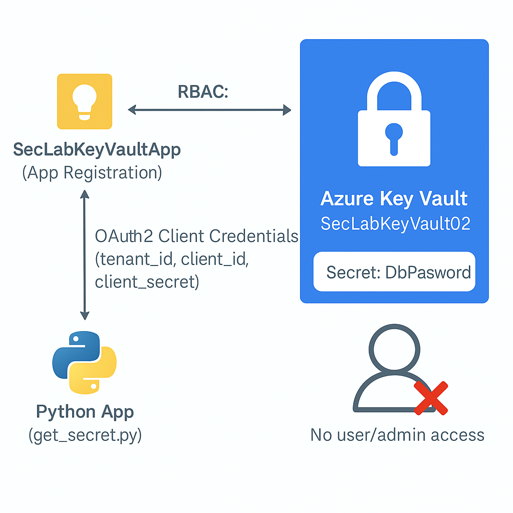

## Azure Key Vault Secrets Management Lab

Implementation of secure, app-only secrets management using Azure Key Vault and RBAC. This lab demonstrates real-world secrets protection, automated access controls, and secret rotation—addressing the #1 cloud security risk: credential leakage.

---

## Table of Contents

- [Overview](#overview)
- [Real-World Risk](#real-world-risk)
- [What I Built](#what-i-built)
- [Diagram](#diagram)
- [Objectives](#objectives)
- [Steps Performed](#steps-performed)
  - [1. Resource Group and Key Vault Creation]
  - [2. App Registration and Client Secret]
  - [3. Key Vault Secret Storage]
  - [4. App-Only Access & RBAC Configuration]
  - [5. Automated Secret Retrieval]
  - [6. Secret Rotation and Validation]
  - [7. Audit & Version History]
  - [8. Cleanup & Least Privilege Enforcement]
- [Screenshots](#screenshots)
- [Lessons Learned](#lessons-learned)
- [References](#references)
- [Contact](#contact)

---

## Overview

This lab demonstrates how to securely manage sensitive data (like passwords, API keys, and certificates) in Azure using Key Vault. You’ll see how to restrict access using Azure AD and RBAC so that only applications (not users) can retrieve secrets, and how to automate secret rotation.

Why it matters: Hardcoding or mishandling secrets is the #1 cause of breaches in cloud-native environments. Azure Key Vault, combined with RBAC and app-only authentication, solves this problem in an automated and auditable way.

---

## Real-World Risk
Hardcoding secrets, credentials, or API keys in code or configuration files is the #1 cause of data breaches in cloud-native environments.
Attackers routinely scan public repos, storage, and logs for exposed credentials, which can lead to total cloud compromise.
This lab demonstrates how to eliminate this risk by centralizing secrets in Azure Key Vault, strictly controlling access using RBAC, and enabling automated, auditable secret rotation without any human/admin standing privilege.

---

## What I Built

- An Azure Key Vault with role-based access control (RBAC) for secrets management.
- An Azure AD App Registration with OAuth2 client credentials, enabling secure, app-only authentication (no human access)
- Automated secret storage and retrieval: secrets (like passwords, connection strings) are stored securely and accessed via code, not humans.
- Secret rotation workflow: rotated secrets instantly update for applications, reducing operational risk.
- Zero standing privilege model: all human/admin access removed after setup—only the app can access secrets.
- Comprehensive, step-by-step documentation with architecture diagram and screenshots for technical and non-technical review.

---

## Diagram

---

## Objectives

- Deploy an Azure Key Vault for storing secrets securely.
- Register an Azure AD App and configure app-only access using RBAC.
- Restrict human (user) access—enforcing “zero standing privilege.”
- Retrieve secrets using a script authenticated as the app.
- Rotate a secret and confirm instant application update.
- Document all steps and access controls.

---

## Steps Performed

**1. Resource Group and Key Vault Creation**
   - Created a dedicated resource group for lab isolation and easy cleanup *(Screenshot: `resource-group-create.png`)*
   - Deployed Azure Key Vault (SecLabKeyVault02) with RBAC enabled *(Screenshots: `keyvault-create-details.png` & `keyvault-overview.png`)*

**2. App Registration and Client Secret**
   - Registered an Azure AD application (SecLabKeyVaultApp) for app-to-app authentication *(Screenshot: `app-registration-create.png`)*
   - Created a client secret for secure, passwordless app authentication *(Screenshot: `app-client-secret-created.png`)*

**3. Key Vault Secret Storage**
   - Added a secret (DbPassword) to Key Vault, simulating a sensitive database credential *(Screenshot: `keyvault-add-secret-details.png`)*

**4. App-Only Access & RBAC Configuration**
   - Assigned the “Key Vault Secrets User” role to the app registration at the Key Vault scope *(Screenshots: `keyvault-rbac-app-role.png` & `keyvault-rbac-secrets-user-role.png`)*
   - Verified that RBAC denies all user/human access—only the app can retrieve secrets *(Screenshots: `keyvault-rbac-blocks-human-access.png` & `keyvault-final-role-assignments.png`)*

**5. Automated Secret Retrieval**
   - Used a Python script authenticated as the app to retrieve the secret securely *(Screenshots: `app-token-acquisition-success.png` & `keyvault-app-secret-retrieval.png`)*

**6. Secret Rotation and Validation**
   - Rotated the secret by creating a new version in Key Vault *(Screenshot: `keyvault-secret-rotation-new-version.png`)*
   - Re-ran the script to confirm the new secret value is instantly available to the app *(Screenshot: `keyvault-app-secret-retrieval-rotated.png`)*

**7. Audit & Version History**
   - Viewed the secret’s version history for full auditability *(Screenshot: `keyvault-secret-version-history.png`)*

**8. Cleanup & Least Privilege Enforcement**
   - Removed all user/admin roles from the Key Vault after setup
   - Documented “zero standing privilege” and least privilege, leaving only the app registration with access *(Screenshot: `keyvault-final-role-assignments.png`)*

---

## Screenshots

*All screenshots are included in the `screenshots/` folder.*

| Step | Filename                                  | Description                                            |
| ---- | ----------------------------------------- | ------------------------------------------------------ |
| 1    | resource-group-create.png                 | Resource group created for the lab                     |
| 2    | keyvault-create-details.png               | Key Vault creation form with RBAC enabled              |
| 3    | keyvault-overview\.png                    | Key Vault overview page                                |
| 4    | app-registration-create.png               | App registration details before creation               |
| 5    | app-client-secret-created.png             | Client secret created for app registration             |
| 6    | keyvault-add-secret-details.png           | Adding a new secret to Key Vault                       |
| 7    | keyvault-app-secret-retrieval.png         | Script output retrieving the secret value              |
| 8    | keyvault-rbac-app-role.png                | RBAC role assignment to the app registration           |
| 9    | keyvault-rbac-secrets-user-role.png       | App registration assigned as Key Vault Secrets User    |
| 10   | keyvault-rbac-blocks-human-access.png     | RBAC blocks user/human access to secrets               |
| 11   | app-token-acquisition-success.png         | Token acquisition successful using client secret       |
| 12   | keyvault-secret-rotation-new-version.png  | Rotating secret: creating a new version in Key Vault   |
| 13   | keyvault-app-secret-retrieval-rotated.png | Script output after secret rotation (shows new value)  |
| 14   | keyvault-secret-version-history.png       | Secret version history (multiple versions shown)       |
| 15   | keyvault-final-role-assignments.png       | Final IAM/RBAC state: only app registration has access |
 
---

## Lessons Learned

- Real-World Risk Mitigated: Prevented hardcoded secrets and credential leaks, which are the top causes of data breaches in the cloud.
- Zero Standing Privilege: Validated how to remove all human/admin access post-deployment—enforcing least privilege and zero trust.
- RBAC and Troubleshooting: Learned to troubleshoot RBAC propagation and client secret issues (including Azure quirks with secret copying).
- Automation: Demonstrated secrets management and rotation that requires no downtime or code changes for consuming applications.
- Documentation: Used detailed screenshots and explanations to prove security configuration and skills for technical/recruiter review.

---

## References

- [Azure Key Vault documentation](https://learn.microsoft.com/en-us/azure/key-vault/general/overview)
- [Manage access to Key Vault with RBAC](https://learn.microsoft.com/en-us/azure/key-vault/general/rbac-guide?tabs=azure-cli)
- [App registrations in Azure AD](https://learn.microsoft.com/en-us/entra/identity-platform/quickstart-register-app)
- [Azure Key Vault Python SDK](https://learn.microsoft.com/en-us/python/api/overview/azure/key-vault?view=azure-python)

## Contact

Sebastian Silva C. – July, 2025 – Berlin, Germany.  
[LinkedIn](https://www.linkedin.com/in/sebastiansilc) | [GitHub](https://github.com/SebaSilC) | [sebastian@playbookvisualarts.com](mailto:sebastian@playbookvisualarts.com)
